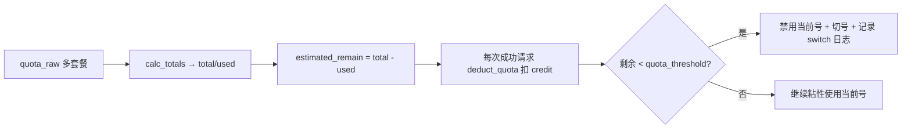

# 额度计算与多套餐包汇算 — 说明

> 本文档说明 cbcn2api 如何从一个账号的多个套餐包汇算出**总额度 / 总已用 / 剩余额度**，
> 以及该额度如何驱动调度切号。对应实现：`src/api/quota.py` + `src/proxy/token_rotator.py`。

## 一、数据来源

每个账号在导入/刷新时调用上游 `copilot.tencent.com/v2/billing/meter/get-user-resource`，
原始响应存入库表的 `quota_raw` 字段。有效数据位于嵌套结构：

```
quota_raw.userResource.data.Response.Data.Accounts  （数组，一行一个套餐包）
```

`Account` 模型的 `quota_raw` 保留整个响应；`calc_totals()` 只从 `Accounts` 汇算。

## 二、套餐包字段语义（上游实测）

每个包关键字段（实测真实返回值）：

| 字段 | 含义 | 实测值 |
|------|------|--------|
| `PackageCode` | 套餐类型码 | `TCACA_code_00X_...` |
| `PackageName` | 套餐名称 | `CodeBuddy个人体验版` / `...国内运营裂变包` 等 |
| `Status` | 资源状态 | `0`=有效有剩余；`3`=已耗尽（remain=0） |
| `CycleCapacitySize(Precise)` | 当前周期总容量 | 整数（500 / 100 等） |
| `CycleCapacityRemain(Precise)` | 当前周期剩余容量 | 整数 |
| `CapacitySize` / `CapacityRemain` | 兜底字段（部分接口返回） | — |
| `CycleStartTime` / `CycleEndTime` | 计费周期 | — |

> **一个重要事实（已实测确认）**：同一个账号名下往往有**几十个套餐包**——例如
> 「个人体验版 500」+ 每日一键产生的「裂变包 100 × N」。历史 bug 是把 `Status=3`
> （已耗尽、remain=0）的包也计入，导致这些已用完的裂变包额度全被当作 used 累加，
> 估算剩余被压成 ≈0 —— 「账号明明还有额度却被当成用完提前切号」。现只累计 `Status=0`。

## 三、汇算规则（当前实现，2026-08）

### 双口径（重要）

额度计算有**两个口径，必须分开**，混用会导致 bug：

| 口径 | 函数 | 统计范围 | 用途 |
|------|------|----------|------|
| **调度口径** | `calc_totals(qr)` 默认 `active_only=True` | 只算 `Status=0` 有效包 | 估算剩余、阈值切号 —— 只关心「现在还能用多少」 |
| **展示口径** | `calc_totals(qr, active_only=False)` | `Status=0` + `Status=3` 全量 | UI 总额度/已用/详情 —— 给用户看「总共获得过多少额度、用了多少、剩多少」 |

> 为什么分开？已耗尽的 `Status=3` 包也是账号**获得过**的额度，展示时必须计入
> 总额度（否则用户看到的总额度比实际小很多）。但调度切号只关心当前还能用多少，
> 已耗尽的包剩余为 0、不能贡献可用额度，所以调度只算有效包。

### parse_resources(accounts, active_only=True)

1. **过滤**：
   - `active_only=True`：`_is_active()` 仅保留 `Status == 0`（调度用）
   - `active_only=False`：保留 `Status=0` 和 `Status=3` 全量（展示用）
2. 按 `PackageCode` 分类：
   - `_merge(base_merge)`：礼包（`_006_`）+ 个人版（`_008_`）**合并**为一个条目的总额/总剩余；
   - 每个 pro 包（`_002_`/`_003_`）单独成一条；
   - 每个 activity 裂变包（`_007_`）**单独成一条**（含已耗尽的，展示用）；
   - 免费包（`_001_`）合并为一条；
   - 额外包（`_009_`）合并为一条。
3. **过滤零值**：`total<=0 且 remain<=0` 的条目丢弃。

`calc_totals(quota_raw, active_only=True)`：

```
total = Σ 每条目的 total       # 套餐总容量（active_only=False 时含已耗尽包）
used  = Σ 每条目的 used       # 每条 used = 该包 total - remain
remain = total - used         # 总剩余额度（Status=3 包 remain=0，不影响剩余）
```

调用方：
- 调度：`token_rotator._refresh_estimates` → `calc_totals(qr)`（只算有效）
- 展示：`get_stats` / `fetch_quota` → `calc_totals(qr, active_only=False)`（全量）

## 「总额度」语义确认（回答：现在是不是按总容量算？）

**答：对。** 现在不是按单个套餐算，而是把账号名下所有 `Status=0` 的套餐
（体验版 + N 个裂变包 + 可能的其他类型）的 `total` 累加、`remain` 累加，
得出「账号总剩余」。上面真实账号示例：

```
账号 17181xx024：26 个套餐 —— Status=0 共 12 条（500 体验 + 11 条 100 裂变）
Status=3 耗尽 14 条（各 1500/100，remain=0）不计入
⇒ total=500 + 11×100 = 1600.00
⇒ used≈70.23（只有 1 条裂变耗了 70.23）
⇒ remain≈1529.77
```

这与上游 App 显示的总剩余一致。

## 三、额度如何驱动调度（衔接 token_rotator）



细节：

- `token_rotator.reload()` 调 `_refresh_estimates()`，用 `quot_total - used` 得到的真实剩余做初始化，
  `calibrate=True` 时直接覆盖，否则取 `min(快照值, 运行期累积值)` 防抬高。
- 每次请求成功后按 `usage.credit`（积分消耗）从 `estimated_remain` 扣。
- **`quota_threshold`（切号阈值，UI「额度阈值」）**：当某号 `estimated_remain < threshold`
  且存在「剩余额度 ≥ threshold」的可用备选时，自动禁用该号并切到备选，写一条切换日志；
  反过来说 —— **只要没触到阈值、又没遇到异常（429/403/11140/超时等），请求成功就绝不切号**。

## 四、为什么「还有额度却提前切号」的根因已消除

1. 之前：`Status=3` 的耗尽裂变包 → used 虚增 → 剩余≈0 → 一开阈值就切。修复：只统计 `Status=0`。
2. 之前：reload 后 `min(旧0值, 正确快照)` 的 `旧0值` 仍是 0 → 持久化的坏估算永远不被覆盖。
   修复：`prev==0` 时信任新快照（0 可能是历史错误估算，无法证明是真实耗尽）。
3. 之前：封号/命中但内联 200 的 `{"code":11140,...}` 被误判为「假死 transient」（1 分钟冷却），
   不会进入渐进封号。修复：`first_event_kind` 识别顶层 `11140` → 正确按 banned 处理。

## 五、验证方式

自动化测试（真实 sqlite、真实 quota 结构）：

- `tests/test_rotation_core.py`：核心调度语义（粘性、冷却分级、阈值换号、**估算刷新防 0 值卡死**、
  切号日志完整写入、并发不卡死）—— 当前 61/61 通过。
- `tests/test_failover.py`：代理链路（429/封号/超时/内联错误/连接失败 → 正确切换或不切换、防重发）—— 37/37 通过。
- 真实 DB 账号实测：`18321...` 等账号直接请求上游 `deepseek-v4-flash`，观察 `usage.credit`、
  SSE 结构、封号返回（403+`{"code":11140,"msg":"request illegal"}`）后按算法模拟回放 —— 全部符合预期。

## 五.5 复测记录（2026-08，真实 DB 全量 16 个正常账号）

针对「多套餐包按**总额度**计算」这一核心语义，用真实 DB 重新逐账号核对：

| 复测项 | 结果 |
|--------|------|
| calc_totals 汇算 vs 手工只累加 `Status=0` 套餐（total 与 remain 逐包核对） | **16/16 全部一致** |
| reload 后 `estimated_remain` vs `calc_totals`（总额度-已用） | 一致 |
| 阈值联动：阈值 > 剩余 → 扣 0.01 必须切号 | 通过（`18321383409` 切到 `19216732642`） |
| 阈值联动反例：阈值 = 剩余 10%，连续扣 50 次 | 绝不抢先切号，通过 |
| 成功请求（真实上游）→ 不切号、0 条 switch 日志 | 通过 |

复测踩到一个测试自身的坑：用真实库跑阈值切号会把该账户持久化为 `disabled`（这是 deduct_quota
的正常行为），导致下次 reload 时该号天然不可用而「误判」为不切。**复测结束已把 `18321383409`
恢复为 `normal`、清空 switch 日志残留**，正式测试 61/61 + 37/37 全绿。打包前请再确认库状态干净。